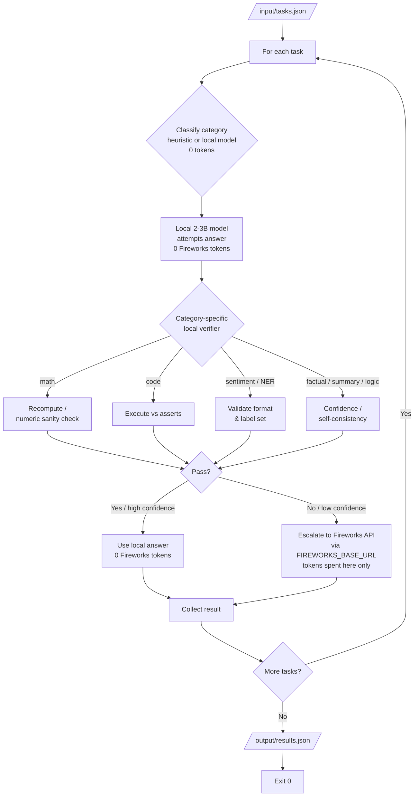

# Architecture 1 — Hybrid Local-First Agent (Track 1)

> Proposed architecture for the Track 1 agent. Goal: clear the **80% gate (≥ 16 / 19 tasks)**
> while spending the **fewest Fireworks tokens**, by answering as many tasks as possible with a
> bundled **local model at zero Fireworks-token cost** and escalating to the Fireworks API only
> when a local answer can't be trusted.
>
> Related: [track-1.md](track-1.md) (Part 0 — Launch-Day Facts). Supersedes the pure
> Fireworks-only routing design as the target architecture.

## Core principle

Ranking is *fewest tokens among gate-passers*, and **only tokens routed through
`FIREWORKS_BASE_URL` count**. A local model that answers correctly = **zero** Fireworks tokens =
the best possible ranking outcome (`flagged: ZERO_API_CALLS` is a valid, non-failing result). So
every task we can answer locally *and verify* is free — the whole design optimizes for that.

## Key design decisions

1. **One local model, two jobs — no separate router model.** On the 4 GB RAM / 2 vCPU grading
   box a second model is dead weight. A single bundled **2–3B 4-bit instruct model** does both
   category classification (zero-shot, one-line prompt) *and* answering the light tasks. A 7B
   4-bit model fills all RAM and leaves no room for agent code, so stay at 2–3B. **No trained
   router and no trained answerer** — the eval uses unseen prompt variants, so training on our own
   synthetic phrasing risks overfitting for little gain. Off-the-shelf instruct models already
   handle these 8 generic categories.

2. **Category selects policy, not the final escalation.** The category tag chooses the prompt
   template, the `max_tokens` cap, and *which verifier* runs. It is **not** the sole trigger for
   going to Fireworks, because difficulty lives in the *instance*, not the category ("2 + 2" and a
   4-step projection are both "math"). Routing purely by category would send easy instances of
   hard categories to Fireworks (wasted tokens) and keep hard instances of easy categories local
   (wrong answers).

3. **Escalate on verification/confidence, not on category.** Wherever an answer can be checked
   locally at zero cost, the local model tries first and we escalate to Fireworks only on failure:
   - **math** → parse the numeric result, recompute / sanity-check → escalate if it doesn't hold
   - **code generation / debugging** → execute against a couple of asserts → escalate on
     throw/fail
   - **sentiment / NER** → validate output format and label/entity-type set → escalate if
     malformed
   - **factual / summarization / logic** → confidence / self-consistency heuristic (no cheap
     ground-truth check), or default per the benchmark map below
   This "try local → verify → escalate on fail" captures the easy instances of *every* category
   for free and spends Fireworks tokens only where the local model actually falls short.

4. **The local-vs-Fireworks map is data-driven, not assumed.** Which categories default to local
   must come from **benchmarking the chosen 2–3B model per category**, not intuition. Working
   hypothesis (to be confirmed): sentiment / NER / factual / summarization answer well locally;
   math / logic / code-gen lean on Fireworks. Confirm with `benchmark/dataset.py` before wiring
   defaults.

## Flow

## What this changes vs. the current implementation

- Current `agent/` is **Fireworks-only** with a heuristic (regex) router. This architecture keeps
  the heuristic classifier as a cheap first pass (or replaces it with zero-shot local
  classification) but adds a **local answering model + per-category verifiers + escalation** in
  front of the Fireworks call.
- The regex router is **not** the accuracy bottleneck and is **not** being replaced by a trained
  model — a misroute only mis-selects a template/cap/verifier, not the answer. The real leverage
  is moving tasks off Fireworks entirely.

## Constraints this must respect

- Local model sized for **4 GB RAM / 2 vCPU** (2–3B, 4-bit). **No Ollama/runtime pre-installed** —
  bundle weights + runtime in the image; **≤ 10 GB compressed**; container **ready < 60 s**;
  **< 30 s per request**; **≤ 10 min** total; English only; exit 0 on success.
- Read `FIREWORKS_API_KEY` / `FIREWORKS_BASE_URL` / `ALLOWED_MODELS` from env only; route all
  Fireworks calls through `FIREWORKS_BASE_URL`; only call models in `ALLOWED_MODELS`.

## Open question (blocks the local-vs-Fireworks map)

How well does a specific 2–3B model answer each of the 8 categories? Benchmark it (no submission
slot needed) to replace "lightweight = local" with a real per-category pass/fail map before wiring
defaults.
