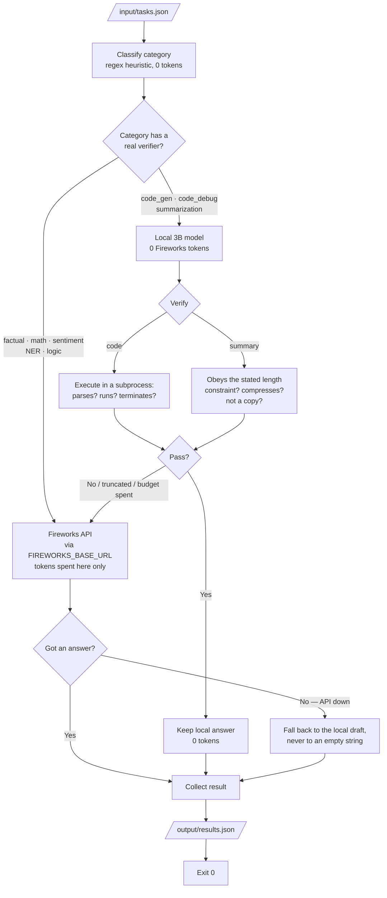

# Architecture 1 — Hybrid Local-First Agent (Track 1)

> Proposed architecture for the Track 1 agent. Goal: clear the **80% gate (≥ 16 / 19 tasks)**
> while spending the **fewest Fireworks tokens**, by answering as many tasks as possible with a
> bundled **local model at zero Fireworks-token cost** and escalating to the Fireworks API only
> when a local answer can't be trusted.
>
> Related: [track-1.md](track-1.md) (Part 0 — Launch-Day Facts). Supersedes the pure
> Fireworks-only routing design as the target architecture.

## Core principle

Ranking is *fewest tokens among gate-passers*, and **only tokens routed through
`FIREWORKS_BASE_URL` count**. A local model that answers correctly = **zero** Fireworks tokens =
the best possible ranking outcome (`flagged: ZERO_API_CALLS` is a valid, non-failing result). So
every task we can answer locally *and verify* is free — the whole design optimizes for that.

## Key design decisions

1. **One local model, two jobs — no separate router model.** On the 4 GB RAM / 2 vCPU grading
   box a second model is dead weight. A single bundled **2–3B 4-bit instruct model** does both
   category classification (zero-shot, one-line prompt) *and* answering the light tasks. A 7B
   4-bit model fills all RAM and leaves no room for agent code, so stay at 2–3B. **No trained
   router and no trained answerer** — the eval uses unseen prompt variants, so training on our own
   synthetic phrasing risks overfitting for little gain. Off-the-shelf instruct models already
   handle these 8 generic categories.

2. **Category selects policy, not the final escalation.** The category tag chooses the prompt
   template, the `max_tokens` cap, and *which verifier* runs. It is **not** the sole trigger for
   going to Fireworks, because difficulty lives in the *instance*, not the category ("2 + 2" and a
   4-step projection are both "math"). Routing purely by category would send easy instances of
   hard categories to Fireworks (wasted tokens) and keep hard instances of easy categories local
   (wrong answers).

3. **~~Escalate on verification/confidence, not on category.~~ → REFUTED. Escalate on category;
   answer locally only where a verifier can check something real.**

   > **This decision was wrong, and it is what failed the 80% accuracy gate** (submission status
   > `ACCURACY_GATE_FAILED`). The original plan was "try every category locally, verify, escalate
   > on failure." The flaw: **without ground truth, a 'verifier' can only check shape, and shape
   > cannot see wrongness.** Measured on the participant guide's own practice tasks (2 vCPU / 4 GB,
   > Qwen2.5-3B Q4), the local model scored **4/8** and every miss sailed through its verifier:
   >
   > | Task | Local answer | Verifier said | Truth |
   > |---|---|---|---|
   > | factual | "Canberra; near the **Australian Alps**" | ✅ non-empty | ❌ asked for a *body of water* |
   > | math | invented a step, answered **108** | ✅ "has a number" | ❌ 144 |
   > | sentiment | bare **"Negative"** | ✅ "has a label" | ❌ mixed review, no justification |
   > | NER | *(timed out at 45 s)* | — | ❌ empty answer shipped |
   >
   > A well-formed wrong answer is *indistinguishable* from a well-formed right one at zero cost.
   > Pretending otherwise converted the local model's ~50% accuracy directly into the submission's
   > accuracy.

   The corrected rule: **a category is answered locally only if we can verify something true about
   the answer.** Two checks qualify, and only two:
   - **code generation / debugging** → extract the code and *actually execute it* in a subprocess.
     Code that doesn't parse, throws on import, or never terminates is objectively broken. ✅ local
   - **summarization** → the prompt *states* the constraint ("in exactly one sentence", "in 50
     words"), so we can check the answer against it, and against the source (a summary must
     compress, and must not be a verbatim copy). ✅ local
   - **factual / math / sentiment / NER / logic** → no sound ground-truth-free check exists.
     **Not answered locally at all.** ❌ Fireworks

   Escalating a good answer wastes tokens; keeping a wrong one loses the gate — and the gate is
   binary. The asymmetry is not close, so we don't gamble on the unverifiable categories.

4. **The local-vs-Fireworks map is data-driven, not assumed.** ✅ **Resolved** — see the table in
   "Measured results" below. Note that the *first* benchmark (36/40 on our own synthetic tasks,
   with our own keyword/numeric checkers) badly overstated local accuracy: lenient checkers on
   self-written tasks are not a proxy for an LLM judge on unseen ones. The practice tasks published
   in the guide were the first honest signal.

## Flow

The two phases **overlap**: the Fireworks calls are IO-bound and the local phase is CPU-bound
(llama.cpp releases the GIL while decoding), so the local phase costs almost no extra wall clock.

## Measured results

Guide's 8 practice tasks, in-container, `--cpus=2 --memory=4g` (the grading box's shape):

| Configuration | Accuracy | Fireworks tokens | Runtime |
|---|---|---|---|
| Local-first everywhere (the version that failed the gate) | **4/8 (50%)** | — | 300 s (budget-capped) |
| All-Fireworks | 8/8 | 1,881 | 3 s |
| **Verified subset (current)** | **8/8 (100%)** | **1,049 (−44%)** | 95 s |

The verified subset answers summarization + both code tasks locally at **zero tokens**, all three
passing verification, and routes the other five to Fireworks.

## Every wait is bounded, and a watchdog guarantees output

> **The submission after the accuracy fix returned `TIMEOUT`** (2026-07-12) — didn't finish in
> 10 minutes, scored zero. Both failures so far trace to the local model, in opposite ways: the
> first trusted it too much, the second let it run too long.

The bug, stated generally: **the run had a budget, but not a deadline.** `time_budget` was checked
*before* dispatching a task and never again, so anything already in flight ran unbounded.

1. **The regression.** `_last_resort_local` (added by the accuracy fix) checked the clock, then
   queued on `LocalModel._gen_lock` — an unbounded `with self._gen_lock:`. Local generations
   serialize on one llama.cpp context at ~45 s each, so a degraded API sends *every* task down
   this path and they stack behind the lock, with nothing re-checking the clock after the wait.
   `ThreadPoolExecutor.__exit__` waits for all of them.
2. **A deadline-blind retry ladder.** 2 tiers × 3 attempts × 25 s = **150 s for one task**, and a
   task could start at t=539 s against a 540 s budget. "Excessive retries" is exactly what the
   guide lists under `TIMEOUT`.
3. **`local_task_timeout` never bounded prefill.** It checks the clock *between streamed tokens*,
   but llama.cpp yields nothing until the whole prompt is evaluated — and prefill dominates on
   2 vCPU. **Prefill cannot be interrupted from Python at all.**
4. **Escalations were banked** until the whole local phase finished, stacking the Fireworks tail
   into the back half of the container's life.

The fix, in layers — the last one is the only actual *guarantee*:

- **Deadlines are enforced inside every wait**, not just before it. The Fireworks client clamps
  each attempt's HTTP timeout to the time left and stops retrying when there is none; `LocalModel`
  acquires its lock *with a timeout* and re-checks the deadline once it holds it.
- **Bound the input, since prefill can't be bounded.** `local_max_prompt_chars` keeps oversized
  prompts out of the local phase entirely.
- **Escalate on the spot**, so Fireworks work overlaps the remaining local work.
- **A watchdog writes results and force-exits.** Because of (3), no amount of bookkeeping can
  *guarantee* a generation returns — so we stop relying on the pipeline finishing. A daemon thread
  armed before the model load fires at `hard_budget` (510 s), writes whatever answers exist, and
  `os._exit(0)`s from under the running threads. (`os._exit` is deliberate: a clean shutdown joins
  workers, and a thread stuck in C will not join.)

**A partial results file always beats a missing one.** Unanswered tasks merely grade wrong;
`TIMEOUT` throws away the answers we *did* compute.

Budgets: `time_budget` 540 → **420** (soft), `hard_budget` **510**, `local_budget` 300 → **150**,
`max_retries` 2 → **1**, `local_task_timeout` 60 → **45**. For 19 tasks: healthy ≈ 200 s; a dead
API terminates at the 420 s soft deadline; watchdog backstop at 510 s; ~90 s of margin under the
600 s kill.

**A load crash no longer kills the container, either.** `_init_local_model` caught only
`LocalModelError`, but loading a GGUF drops into C: a bad ISA raises `OSError` (SIGILL) and 1.9 GB
on a 4 GB box can raise `MemoryError`. Both escaped and exited non-zero (`RUNTIME_ERROR`). It now
catches everything and degrades to Fireworks-only. **The local model is an optimisation; nothing
about it is worth failing the run for.**

## Never ship an empty answer

`_FALLBACK_ANSWER = ""` used to be the response to any failure. An empty answer is graded **wrong
with certainty**; an unverified local draft is merely *likely* wrong — strictly better. So the
precedence is now: Fireworks answer → the local draft we already generated (free) → one unverified
local generation → only then `""`. In the failed run, an NER task timed out locally and shipped an
empty string; that path no longer exists.

## What this changes vs. the pre-mortem implementation

- The regex router is **not** the accuracy bottleneck — a misroute mis-selects a template and a
  cap, not the answer. It now also selects *which backend*, so a misroute into a local-eligible
  category is the one costly case; the verifiers catch it (a "summary" of a math question won't
  respect a constraint that isn't there... but it will be *kept*, so keep the router's
  local-eligible patterns tight).
- Local inference costs **~31–45 s/task on 2 vCPU**, so the local budget only ever covers a handful
  of tasks. This is fine now that local handles a *subset* by design, but it means "answer
  everything locally" was never reachable on this hardware anyway.

## Constraints this must respect

- Local model sized for **4 GB RAM / 2 vCPU** (2–3B, 4-bit). **No Ollama/runtime pre-installed** —
  bundle weights + runtime in the image; **≤ 10 GB compressed**; container **ready < 60 s**;
  **< 30 s per request**; **≤ 10 min** total; English only; exit 0 on success.
- Read `FIREWORKS_API_KEY` / `FIREWORKS_BASE_URL` / `ALLOWED_MODELS` from env only; route all
  Fireworks calls through `FIREWORKS_BASE_URL`; only call models in `ALLOWED_MODELS`.

## The lesson, stated plainly

**Token efficiency is a ranking; accuracy is a gate.** Optimising the ranking at the expense of the
gate scores zero, and that is precisely the trade the original local-first design made — it spent
300 s of CPU to *lower* the submission's accuracy. Local inference is only free if the answer is
right, so the local model may only be trusted where being wrong is *detectable*. Everywhere else,
paying tokens is the cheap option.

And the second lesson, learned the same way: **a budget you only check before starting work is not
a budget.** Every blocking wait — a lock, an HTTP call, a subprocess — needs the deadline passed
*into* it. When a dependency cannot be interrupted at all (C extensions; llama.cpp prefill), the
only honest answer is an out-of-band watchdog that writes the output and force-exits. Both of the
local model's failure modes cost a whole submission; both were bounded by treating it as an
optimisation that must never be able to take the run down with it.
